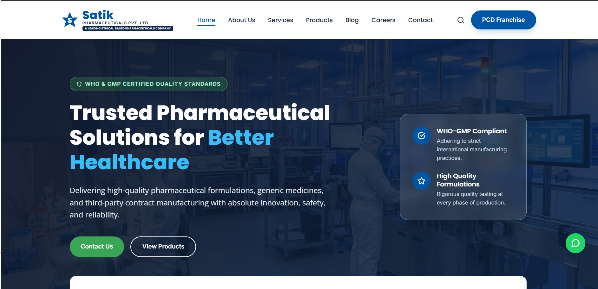

# 💊 Pharmacy Website Project

This is a simple **Pharmacy Website** built with **HTML**, **CSS**, and **JavaScript**.  
It provides an easy and user-friendly platform to browse medicines, view product details, and manage online orders.

---

## 📸 Project Preview (Thumbnail)

---

## 🛠️ Technologies Used

- HTML5
- CSS3
- JavaScript
- Google Font Api
- JSON-LD

---
## 🔥 Interactive Elements

- Responsive and user-friendly interface
- Scroll-based sticky header menu
- Animated FAQ accordion
- Floating WhatsApp chat with pre-filled PCD franchise inquiry
- Google Maps integration 
- Sliding success toast notifications for form submissions
- Fast and smooth navigation across all pages.
---

## 📚 How It Works

- Users browse available medicines.
- Search medicines by name or category.
- Add medicines to the cart.
- Place orders through a simple checkout process.

---

## 🔥 Features

- User-friendly and responsive design
- Medicine search functionality
- Product categories
- Shopping cart
- Product details page
- Easy navigation

---

## 📄 License

Built with ❤️ by **BINDESH**.  
Feel free to use and modify it for your own projects!

---

## 📞 Connect with BINDESH

- LinkedIn: [Follow Here](https://www.linkedin.com/in/bindesh-nishad-8689b2323)
- GitHub: [Follow Here](https://github.com/bindeshnishad03-star)
